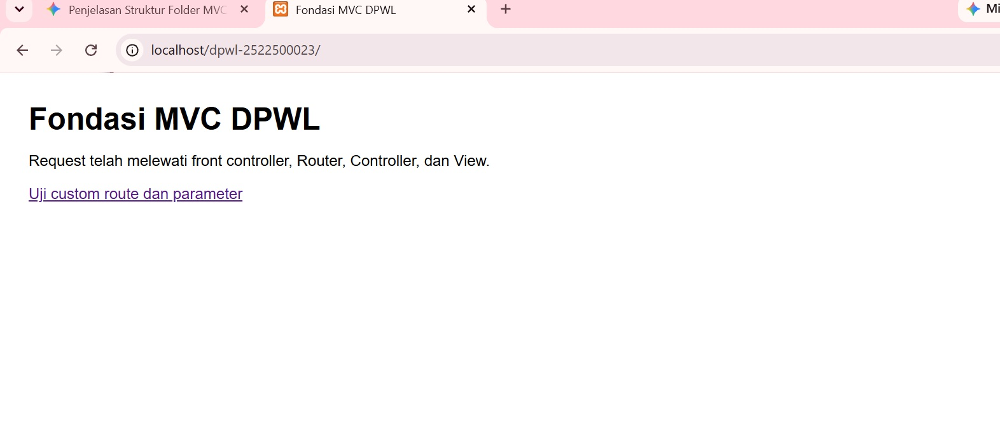
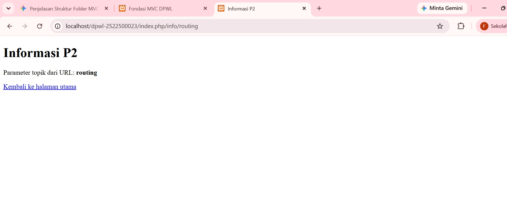

# pertemuan-02
## 1. Tujuan dari Praltikum pertemuan 2
-	Memahami konsep dasar dan alur kerja arsitektur Model-View-Controller (MVC) dengan membuatnya secara manual dari awal (from scratch) tanpa framework. 
-	Menyusun struktur folder aplikasi web agar rapi dan terisolasi dengan baik. 
-	Menerapkan teknik Front Controller sebagai jalur tunggal masuknya request. 
-	Membuat sistem Routing untuk memetakan alamat URL ke Controller, method, dan parameter yang sesuai. 
-	Membuat fungsi helper URL (base_url() dan site_url()) untuk mempermudah pemanggilan aset statis dan navigasi antar halaman.

## 2. Struktur Direktori
Folder PATH listing for volume OS
Volume serial number is 0426-97FE
C:.
│   index.php
│   
├───application
│   ├───config
│   │       config.php
│   │       routes.php
│   │       
│   ├───controllers
│   │       Home.php
│   │       
│   ├───helpers
│   │       url_helper.php
│   │       
│   └───views
│       └───home
│               index.php
│               info.php
│               
├───assets
│   └───css
│           app.css
│           
└───system
    └───core
            Controller.php
            Router.php

-application/: Direktori utama yang menampung seluruh kode logika, aturan bisnis, serta tampilan aplikasi yang di buat.
-config/: Berisi file-file konfigurasi aplikasi, seperti pengaturan database, rute URL (routes), autoload library, dan setelan keamanan.
-controllers/: Tempat menyimpan file Controller. Berfungsi sebagai jembatan/pengatur lalu lintas data yang menerima permintaan (request) dari pengguna, memproses logika, lalu menentukan tampilan (view) mana yang harus dimuat.
-helpers/: Berisi fungsi-fungsi bantuan kecil yang sifatnya kustom (misalnya fungsi format tanggal, format mata uang, atau pemotong teks) yang bisa dipanggil di mana saja dalam aplikasi.
-views/: Tempat menyimpan file antarmuka (UI) yang berisi kode HTML/CSS/PHP dasar untuk ditampilkan ke layar pengguna.
-home/: Sub-folder khusus untuk mengelompokkan file tampilan yang berkaitan dengan halaman Home (misalnya index.php, header.php, footer.php).
-assets/: Folder publik yang digunakan untuk menyimpan berkas-berkas statis aplikasi agar bisa diakses langsung oleh browser.
-css/: Tempat menyimpan file stylesheet (.css) yang mengatur tampilan visual dan pemodelan tata letak web.
-system/: Folder inti (core) bawaan framework. Folder ini berisi pustaka dasar, engine utama, dan fungsi bawaan yang membuat framework bisa berjalan.
    
## 3. Front controller
File index.php yang berada di direktori paling luar berfungsi sebagai Front Controller. Tugas utamanya adalah menangkap semua request URL dari browser sebelum diteruskan ke sistem. 
Proses yang dilakukan oleh index.php:
-	Menentukan konstanta jalur folder (FCPATH, APPPATH, SYSPATH). 
-	Memuat (load) file konfigurasi, helper, kelas inti (Controller.php & Router.php), serta aturan rute (routes.php). 
- Mengambil URL yang diakses pengguna. 
- Memanggil Router untuk menjalankan controller dan method yang sesuai. 
Manfaat metode ini adalah membuat struktur kode lebih aman dan tertata, karena pengguna tidak bisa langsung membuka file controller atau view secara acak via URL

## 4. Berikut adalah penambahan tabel route modifikasi ATM (studi kasus Sistem Rental Mobil/Aplikasi DPW) serta penjelasan pemetaan alur komponennya:

| URL/Route | Controller | Method | Parameter | View |
| --- | --- | --- | --- | --- |
| / | Home | index | - | home/index.php |
| home/index | Home | index | - | home/index.php |
| home/info/mvc | Home | info | mvc | home/info.php |
| info/routing | Home | info | routing | home/info.php |
| mobil/detail/(:any) | Mobil | detail | $1 (misal: ID/Kode Mobil) | mobil/detail.php |

- Penjelasan Pemetaan Route → Controller → Method → Parameter → View
1. Route (`mobil/detail/(:any)`)
Sintaks Route: Ditambahkan pada berkas `application/config/routes.php` dengan aturan `$route['mobil/detail/(:any)'] = 'mobil/detail/$1';`.
Mekanisme: Ketika peramban mengakses URL seperti `.../index.php/mobil/detail/MB001`, `Router` mencocokkan pola URI tersebut.
2. Controller (`Mobil.php`)
* `Router` menginisialisasi kelas `Mobil` yang berada di berkas `application/controllers/Mobil.php`.
3. Method (`detail()`) `Router` mengeksekusi method `detail()` di dalam Controller `Mobil`.
4. Parameter (`MB001` / `$1`)
 Nilai variabel dinamis dari URI (misalnya `MB001`) ditangkap oleh wildcard `(:any)` dan diteruskan sebagai argumen ke variabel `$id` pada method `detail($id)`.
5. View (`mobil/detail.php`)
 Method `detail()` memproses parameter tersebut, menyiapkan data, lalu memanggil method `$this->view('mobil/detail', $data)` untuk menampilkan struktur HTML dari berkas `application/views/mobil/detail.php` kepada pengguna.

## 5.	Base URL dan helper (jelaskan fugsi base URl () dan site URL(), kemudian berikan contoh penggunya pada implementasi P2
Base URL berfungsi menghasilkan URL lengkap ke root serta menghasilkan url asset CSS
Localhost/dwpl-2522500023/
Site_url berfungsi menampilkan parameter routing dan  membentuk URL navigasi internal aplikasi melewati front controller 
Localhost/dpwl-2522500023/index.php/info/routing

## 6. Alur Request-response 
Alur Eksekusi Aktual P2
Alur ini berjalan tanpa melibatkan database:
- Browser: User melakukan request URL melalui browser.   
- index.php: Request masuk ke file index.php yang berfungsi sebagai entry point utama aplikasi.   
- Router: index.php meneruskan permintaan ke Router untuk mencocokkan URL dengan route yang sesuai.   
- Controller: Router memanggil Controller untuk memproses permintaan.  
- View: Controller langsung memanggil file View tanpa mengambil data dari Model/database.   
- Response: View dirender menjadi tampilan (HTML/JSON) lalu dikirim kembali ke browser user.   

Posisi Model dalam Arsitektur MVC Lengkap
Alur ini menggambarkan proses MVC secara utuh saat aplikasi sudah terhubung ke database:
- Browser: User melakukan request melalui browser.   
- index.php: Entry point menerima request.   
- Router: Mengarahkan request ke Controller.   
- Controller: Meminta data ke Model karena membutuhkan informasi dari database.   
- Model & Basis Data: Model melakukan query/olah data ke basis data (database), lalu menerima balik hasilnya.
- Model ke Controller: Model mengembalikan data yang sudah diproses ke Controller.  
-  View: Controller mengoper data tersebut ke View untuk disajikan.   Response: Hasil akhir dikirim kembali sebagai respon ke browser.   

## 7. Hasil pengujian Dan debugging
### Gambar 1. Hasil Pengujian debugging

- Hasil Pengujian (Testing)
Pengujian dilakukan menggunakan perintah sintaks PHP CLI (php -l) untuk memeriksa ketersediaan dan keabsahan sintaks (syntax check) pada struktur file kerangka kerja yang dibangun.
1. Skenario Pengujian Valid (Sintaks Benar)
Deskripsi Skenario: Memeriksa seluruh file konfigurasi, helper, controller, dan core router untuk memastikan tidak ada kesalahan penulisan sintaks (syntax error) sebelum aplikasi dijalankan di web server.
  - Langkah Pengujian:
  Menjalankan php -l application\config\config.php  
   Menjalankan php -l application\config\routes.php   
   Menjalankan php -l application\helpers\url_helper.php   
   Menjalankan php -l application\controllers\Home.php   
   Menjalankan php -l system\core\Controller.php   
   Menjalankan php -l system\core\Router.php   

2. Skenario Pengujian Tidak Valid (Penanganan Error Sintaks)
Deskripsi Skenario: Mensimulasikan kesalahan penulisan sintaks pada file penentu arah/alur routing, seperti lupa menyertakan titik koma (;) atau salah menuliskan nama fungsi/kelas pada Router.php atau index.php.   
  - Langkah Pengujian:
  Menghapus tanda ; pada salah satu baris kode di index.php (misalnya baris require_once SYSPATH . 'core/router.php').  
   Menjalankan perintah php -l index.php melalui terminal.

## 8. Bukti Tangkapan Layar
Sisipkan gambar yang relevan dari folder dokumentasi/ dengan perintah:
### Gambar 1. Hasil Pengujian Halaman Utama

### Gambar 2. Hasil Pengujian Custom Route

## 9. Pada Pertemuan 02 (P2), kerangka aplikasi berbasi MVC yang dibangun telah berhasil menyelesaikan fondasi utama arsitektur web.
yang sudah dapat dilakukan oleh kerangka MVC saat ini (P2):
-Front Controller & Single Entry Point: Aplikasi telah menggunakan index.php sebagai satu-satunya titik masuk (entry point) untuk menangani seluruh request dinamis.   
-Sistem Routing Dinamis: Router.php dan routes.php mampu memetakan URL secara fleksibel ke Controller, method/action, serta meneruskan parameter ke komponen aplikasi.   
-Pemisahan Alur Interaksi (Controller & View): Controller berperan mengatur alur logika dan data, sedangkan View hanya berfokus menyajikan struktur HTML.   
-Pengelolaan URL & Aset: Menggunakan Helper (url_helper.php) untuk fungsi base_url() dan site_url() dalam memuat aset statis (seperti CSS) dan membuat tautan navigasi antarhalaman secara konsisten.  
- Handling Error Dasar: Router dan Base Controller mampu mendeteksi dan menangani kondisi Controller/Method tidak ditemukan (HTTP 404) serta View tidak ditemukan (HTTP 500).